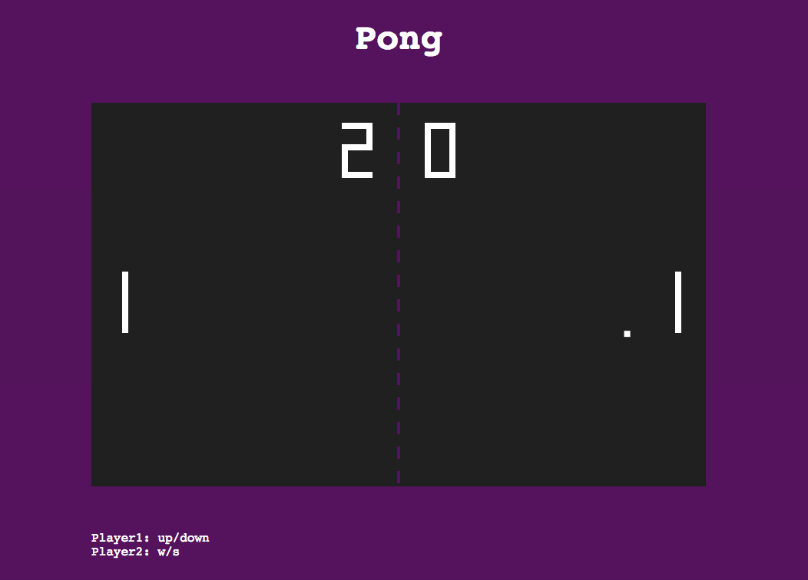

# pong
2 player pong in JavaScript.

## Control
- player1 - 'up' and 'down' key
- player2 - 'w' and 's' key

## Preview
http://htmlpreview.github.io/?https://github.com/Kwangjong/pong/blob/master/pong.html

## Authors
KJ Choi
